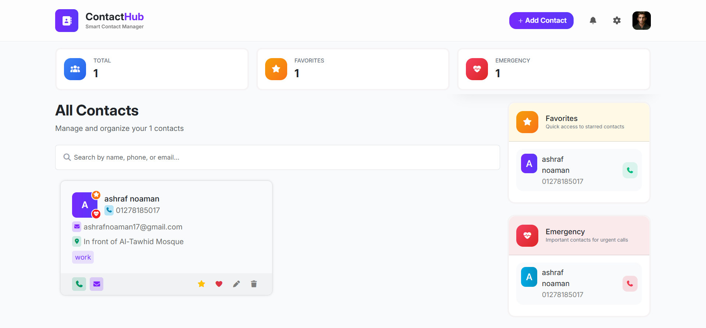

# 📇 ContactHub – Contact Management App

A simple and interactive contact management web application built using **JavaScript**, **HTML**, and **CSS**.

---

## 🌟 Features
- ➕ Add new contacts
- 📝 Edit existing contacts
- ❌ Delete contacts
- 💾 Persistent data stored in **Local Storage**
- 📱 Clean and user-friendly interface

---

## 🛠️ Tech Stack
- JavaScript
- HTML
- CSS

---

## 📸 Screenshots


---

## 🚀 How to Run
1. Clone the repository:
   ```bash
   git clone https://github.com/Ashraf-noaman/contacthub.git
